# netolog
##шаг 1. Предположим, что есть задача — написать скрипт, выводящий на экран параметры его запуска. Давайте посмотрим, как будет отличаться работа над этим скриптом с использованием ветвления, merge и rebase.

Создайте в своём репозитории каталог
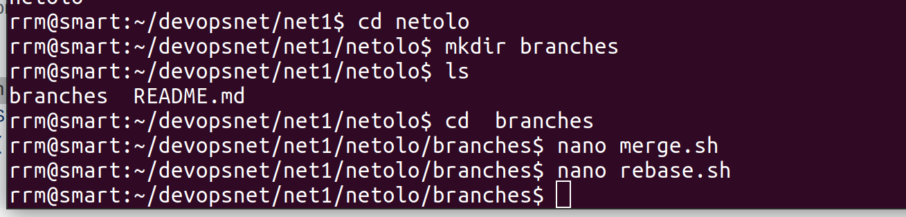

Шаг 2. Создадим коммит 

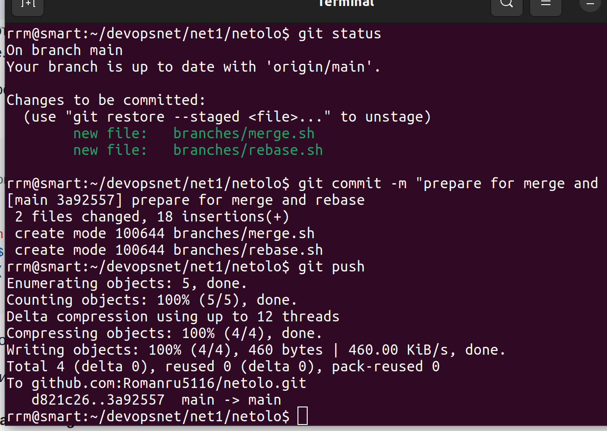

Подготовка файла merge.sh
Шаг 1. Создайте ветку git-merge.
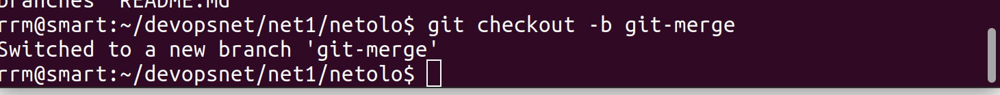

Шаг 2. Замените в ней содержимое файла merge.sh на:
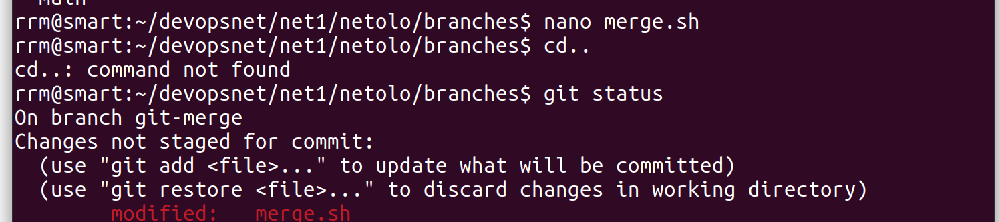

Шаг 3. Создайте коммит merge: @ instead *, отправьте изменения в репозиторий.

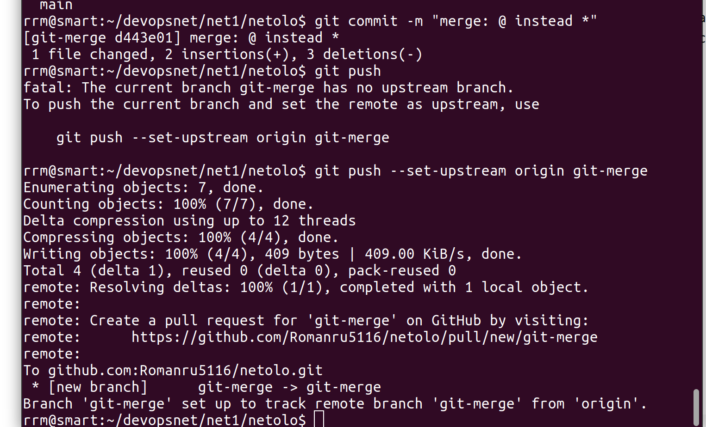

**Шаг 4.** Разработчик подумал и решил внести ещё одно изменение в `merge.sh`:

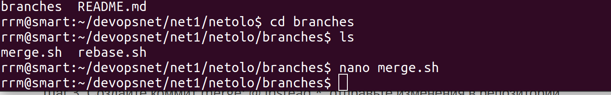

**Шаг 5.** Создайте коммит `merge: use shift`

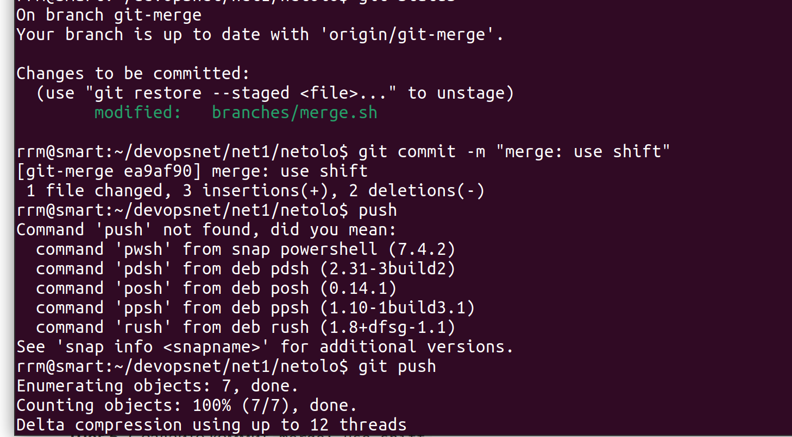

#### Изменим main

**Шаг 1.** Вернитесь в ветку `main`. **Шаг 2.** Предположим, что пока мы работали над веткой `git-merge`, кто-то изменил `main`. Для этого изменим содержимое файла `rebase.sh` на:

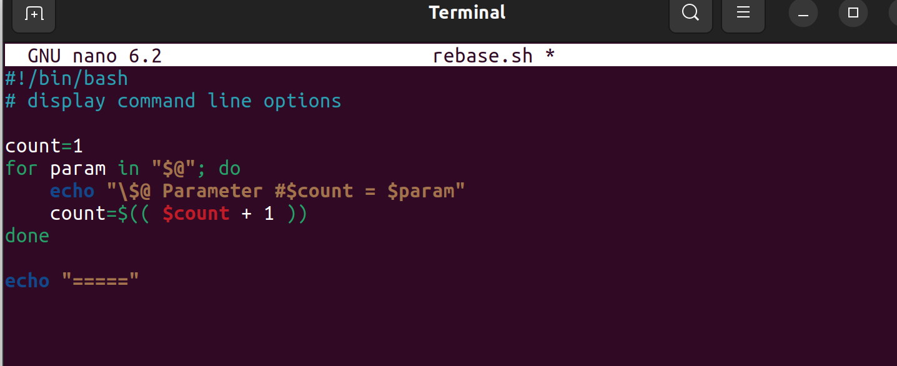

**Шаг 3.** Отправляем изменённую ветку `main`

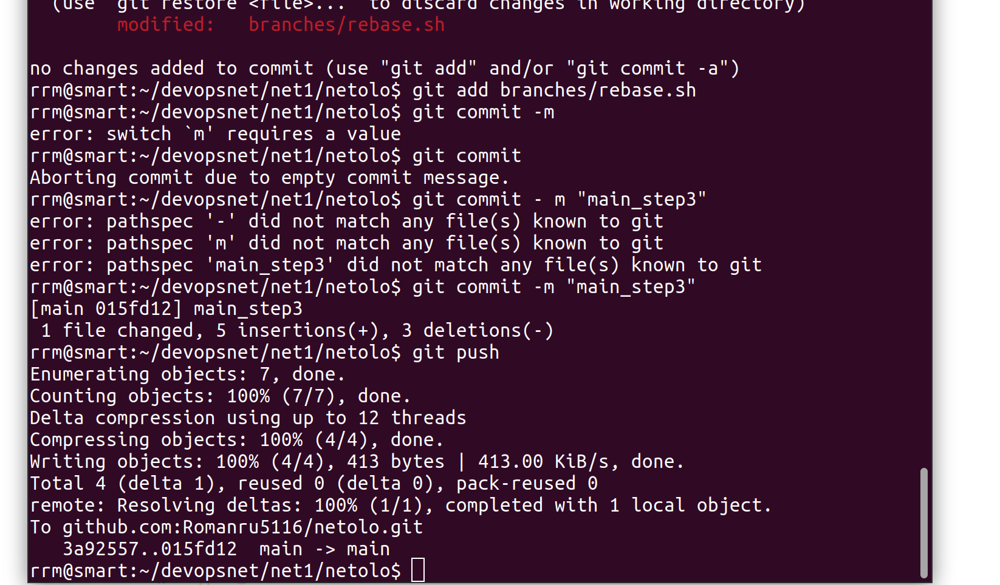

### Подготовка файла rebase.sh

**Шаг 1.** Предположим, что теперь другой участник нашей команды не сделал

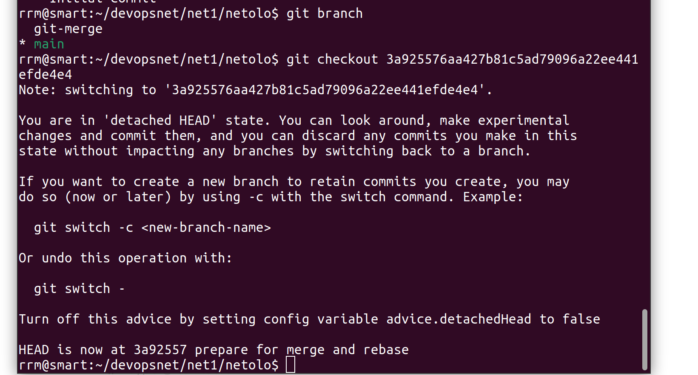

**Шаг 2.** Создадим ветку `git-rebase`, основываясь на текущем коммите.

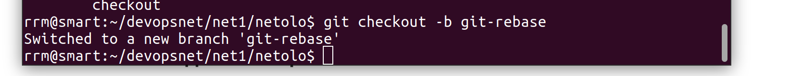

**Шаг 3.** И изменим содержимое файла `rebase.sh` на следующее, тоже починив скрипт, но немного в другом стиле

**Шаг 4.** Отправим эти изменения git rebase1

**Шаг 5 rebase2**

результат

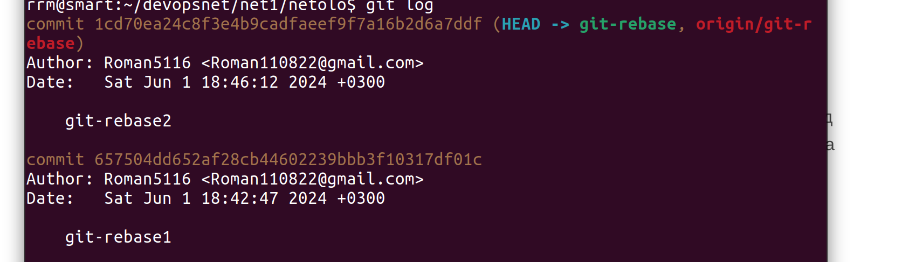

#### Промежуточный итог

на странице картинка совпадает с указанной в условиях задачи:

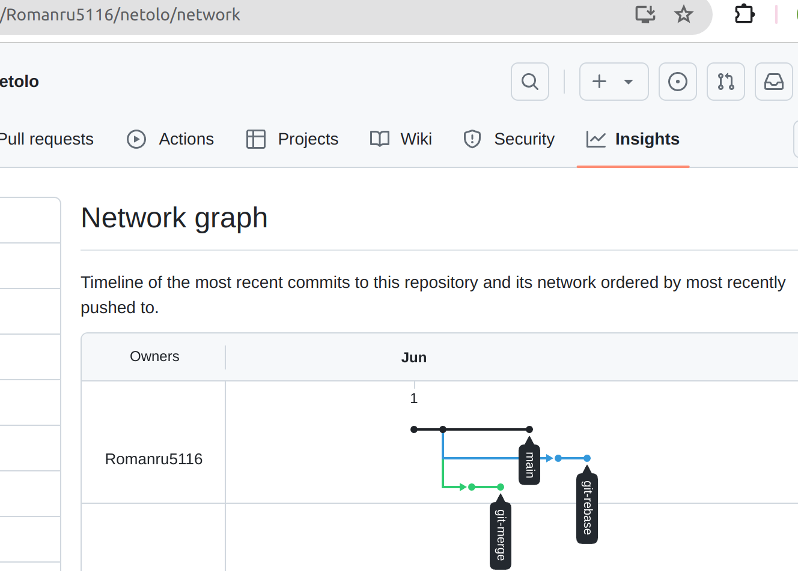

#### Merge

Сливаем ветку `git-merge` в main

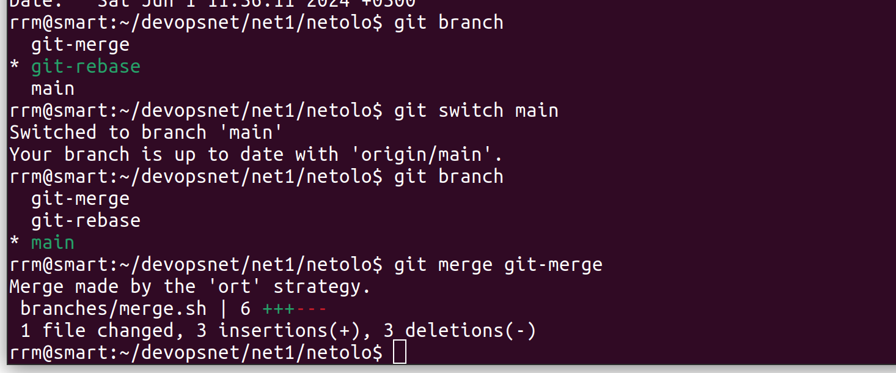

схема не такая почему то
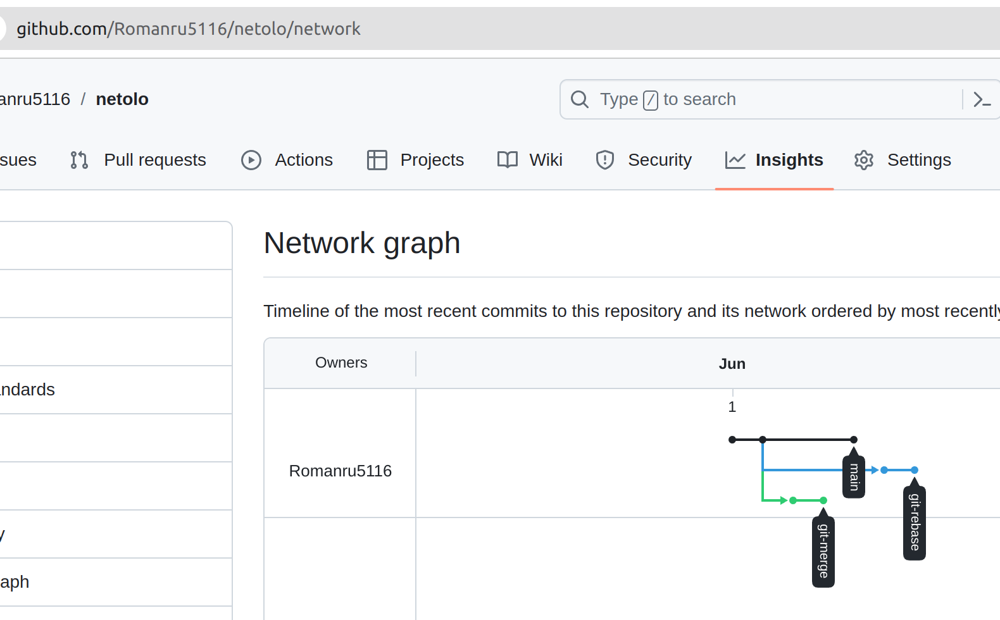
